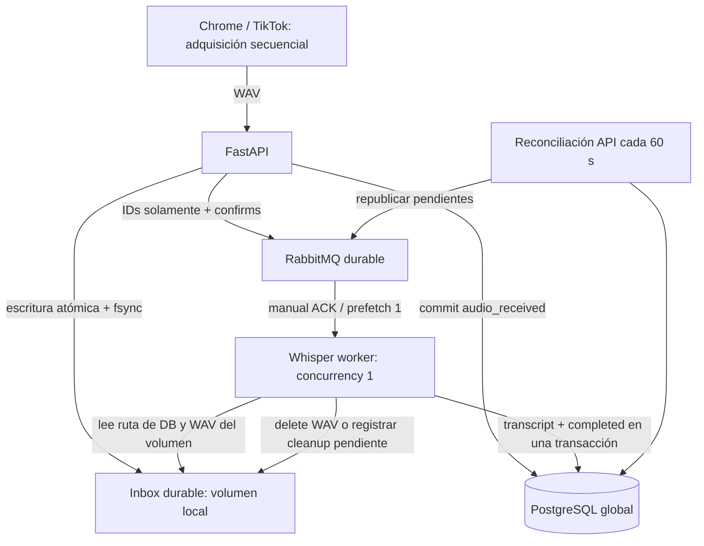

# Phase 2A — adquisición independiente de transcripción

**ACQUISITION ≠ TRANSCRIPTION.** Chrome abierto con acceso a TikTok es el recurso escaso. Mientras existe esa ventana, el collector obtiene WAV útiles; el servidor los procesa cuando hay CPU. Una respuesta con `audio_received=true` permite cerrar Chrome, aunque el transcript tarde minutos u horas.



## Corpus y migración

Los cinco modelos del corpus se conservan: channels, analyses, videos, video_snapshots y transcripts. `videos.tiktok_id` y `transcripts.video_id` siguen siendo UNIQUE globales. Ranking Decimal, elegibilidad, snapshots y cobertura siguen globales y reutilizables. No se guardan MP4 ni URLs privadas de media. Metadata pública únicamente; se mantienen los filtros contra cookies, tokens y otros campos sensibles.

### Corpus incremental global (0.4.1)

`0005_global_incremental_corpus` convierte la recolección en un corpus incremental por canal, sin mover ni borrar el corpus existente. Añade `channels.tiktok_user_id` nullable y único junto a `platform`: `profile.author_id`, cuando el collector lo conoce, es la identidad canónica; `username` queda como metadata pública mutable. La restricción histórica de handle único se retira para permitir el reciclaje de handles por TikTok. Un scan que encuentra un ID estable ya conocido actualiza ese mismo canal y consolida una fila legacy sin ID que tuviera el handle actual.

Los videos siguen siendo globales por `videos.tiktok_id`. `first_seen_at` nunca cambia y `last_seen_at` se refresca en cada scan. Cada scan añade su observación a `video_snapshots`; no borra el histórico. El ranking de adquisición usa para todo el canal la última observación de cada vídeo: mediana de views, tasas like/comment/share/favorite/engagement y `outlier_score = views / median_views`, con protección para cero. El orden es outlier, views y engagement descendentes; no representa una probabilidad viral.

`analysis_acquisitions` es una relación liviana analysis↔video para las reservas. No duplica transcript ni métricas: permite que un análisis actual reciba el mejor vídeo pendiente que fue descubierto en un scan anterior. Al crear o rellenar un batch se excluyen transcript global existente, duración fuera de 8–180 s (hard max 300), estados terminales resueltos y jobs activos válidos; el límite es `ACQUISITION_BATCH_SIZE`.

La respuesta mantiene `channel`, `top_videos` y `enrichment_requests` existentes y añade `scan` (también disponible como `coverage.scan`): `videos_seen_this_scan`, `videos_new`, `videos_refreshed`, `acquisition_requested`. `channel` añade `tiktok_user_id`, `transcripts_total`, `transcripts_missing` y `audio_assessments_total`; conserva `videos_known` y `transcripts_available` para compatibilidad.

### Metadata pública de sonido (0.3.1)

La migración `0004_video_music_metadata` añade al vídeo global nullable `music_id VARCHAR(64)`, `music_title VARCHAR(512)`, `music_author VARCHAR(256)` y `music_original BOOLEAN`. No hay una tabla de sonidos ni copias por análisis o usuario: un TikTok tiene un estado global de metadata de sonido. El contrato estricto de `VideoInput` acepta `music_id` como string decimal de hasta 64 caracteres (nunca se convierte a integer), título/autor no-URL dentro de esos límites y `music_original` exclusivamente como boolean explícito o `null`; `additionalProperties` permanece `false`.

En un upsert, cada uno de esos valores cambia solo si el valor entrante es distinto de `null`; por eso una captura incompleta no borra metadata ya conocida y `false` se persiste correctamente. Esta metadata no participa en YAMNet, reservas, skip ni decisión de Whisper.

`0001_global_corpus.py` está congelada y aplicada en producción. **0002_async_transcription_jobs.py es nueva y no se ha aplicado a producción.** Crea únicamente la tabla operacional e índice de status. Su downgrade elimina esa tabla; no elimina el corpus.

`transcription_jobs`: UUID PK; FK video_id UNIQUE; status con CHECK de siete estados; priority integer default 50; attempts integer default 0; audio_path, audio_size_bytes, audio_duration nullable; reserved_at, audio_received_at, queued_at, started_at, completed_at, failed_at nullable; last_error_code nullable; created_at y updated_at. Una fila por vídeo. La reserva continúa vinculada al análisis mediante videos.enrichment_analysis_id y enrichment_lease_until; no se inventan cuentas de collectors en esta fase.

| Estado | Significado / salida |
|---|---|
| reserved | Reserva sin upload; expira tras lease. Puede reutilizar la misma fila. |
| audio_received | WAV durable y DB confirmada; falta confirmar publicación. |
| queued | Publicación confirmada, o intento recuperable devuelto a RabbitMQ. |
| processing | Intento persistido antes de inferencia; redelivery recupera tras caída. |
| completed | Transcript global confirmado; audio borrado o cleanup_pending registrado. |
| failed | Intentos agotados; terminal, retención de audio limitada. |
| expired | Reserva sin WAV vencida; otra adquisición reutiliza la fila. |

`missing → reserved → audio_received → queued → processing → completed`. Recuperable: `processing → queued`. No se reinician automáticamente jobs failed. Si existe transcript, no se crea un job nuevo; una entrega duplicada completa la fila existente y limpia audio obsoleto.

## Contrato de adquisición y upload

1. `POST /api/v1/analyses` recibe profile + videos públicos, hasta 500, mantiene ranking global y reserva el primer batch.
2. `POST /api/v1/analyses/{analysis_id}/acquisition-batches` devuelve el análisis y enrichment_requests pendientes. Default `ACQUISITION_BATCH_SIZE=10`. Rellena hasta diez reservas pendientes propias, sin acumular reservas extra al repetir la petición. Excluye transcript existente, job recibido/queued/processing, failed terminal, reserva ajena activa y duración no elegible. Después de subir un batch pueden pedirse los siguientes sin crear otro análisis.
3. Procesar IDs secuencialmente y enviar `POST /api/v1/analyses/{analysis_id}/videos/{tiktok_id}/audio`, multipart con exactamente un archivo `audio` y MIME WAV.
4. El upload responde **HTTP 202**, sin invocar ni esperar Whisper:

```json
{"status":"queued","video_id":"UUID","job_id":"UUID","audio_received":true}
```

Si RabbitMQ está caído, responde también 202 con `status=audio_received` y `audio_received=true`: el audio ya está a salvo en el inbox y se republicará. Si hay un reintento del mismo upload, devuelve su estado actual sin sobrescribir audio ni publicar otra vez. Si ya hay transcript, devuelve `status=already_transcribed`; no requiere otro audio. Un ID interno de vídeo UUID y el ID TikTok son identificadores distintos.

Errores: reserva ajena/vencida 409; WAV inválido o duración no elegible 422; MIME no admitido 415; exceso de tamaño 413. Capacidad insuficiente devuelve exactamente:

```json
{"code":"audio_queue_capacity","retryable":true}
```

con HTTP 503. El collector debe pausar adquisición y reintentar con backoff; no esperar transcript para avanzar tras 202. La extensión actual sigue en su flujo de prueba local: no se conecta automáticamente al backend público ni implementa todavía el auto-loop completo.

Se acepta temporalmente INITIAL_ENRICHMENT_BUDGET y TOP_TRANSCRIPTS como alias de configuración; ACQUISITION_BATCH_SIZE prevalece. GET del análisis consulta el avance global, no rellena reservas. `transcribed` describe las solicitudes del análisis, no cobertura total del canal. Coverage usa la observación más reciente por vídeo y no cuenta snapshots repetidos dos veces.

## Inbox durable y backpressure

`AUDIO_STORAGE_BACKEND=local` conserva el inbox Swarm `kurukin_tiktok_audio_queue`: `<job_uuid>.part` exclusivo 0600, escritura, flush, fsync, os.replace y commit `audio_received`. Es el formato legacy `/data/audio-queue/<job_uuid>.wav` y sigue siendo reconocible durante la transición.

`AUDIO_STORAGE_BACKEND=minio` escribe para nuevos jobs un único objeto S3 compatible `transcription/v1/<job_uuid>.wav`. La API valida el WAV antes de PUT, confirma el objeto con HEAD, guarda `minio://<bucket>/transcription/v1/<job_uuid>.wav` en `audio_path`, confirma `audio_received` y sólo entonces publica Rabbit. No existe una transacción distribuida: un crash entre PUT y commit deja un huérfano que la reconciliación puede borrar después de dos horas. MinIO usa endpoint configurable; el default Swarm es `http://minio:9000` y las credenciales son de aplicación restringida, nunca root.

Se valida RIFF/WAVE PCM, chunks, formato, bytes y duración tanto en API como al comenzar el worker, mediante las mismas funciones. MAX_AUDIO_MB=10; duración automática 8–180 s, hard limit 300 s configurable con min ≤ auto ≤ hard. Se mantiene el validador PCM del milestone anterior: la extensión entrega PCM16 mono 16 kHz; también acepta los formatos PCM previamente admitidos. No hay segunda implementación de Whisper.

Un flock del inbox serializa admisión, escritura y limpieza entre procesos del mismo nodo. Los bytes usados incluyen .part y WAV; se comprueba además el tamaño entrante y espacio libre proyectado. Defaults:

| Configuración | Valor |
|---|---|
| AUDIO_QUEUE_MAX_BYTES | 3 GiB |
| AUDIO_QUEUE_MIN_FREE_BYTES | 5 GiB |
| AUDIO_QUEUE_MAX_JOBS | 2000 jobs activos |
| FAILED_AUDIO_RETENTION_HOURS | 24 |
| RECONCILIATION_INTERVAL_SECONDS | 60 |

La adquisición de nuevos batches se pausa al alcanzar el cap de jobs. Las reservas ya contabilizadas pueden completar su upload sin aumentar el número de jobs; si la cuenta supera el cap se rechazan también esos uploads. Reservas vencidas son retiradas de la cuenta por reconciliación. Bytes en el cap o espacio libre en el mínimo rechazan entrada. El middleware limita cada body y admite como máximo dos POST simultáneos en su tramo de buffering/procesamiento, para acotar memoria de la API.

El volumen local es durable frente a reinicio de contenedores, **no es un backup ni almacenamiento distribuido**. MinIO elimina esa dependencia para nuevos jobs; cada worker sólo necesita un scratch privado local para descargar el objeto durante YAMNet/Whisper y lo elimina en `finally`.

## Publicación y recuperación

Pika 1.3.2; queue clásica `transcription.v1`, durable, x-max-priority=100, mensajes delivery_mode=2, mandatory y publisher confirms. Constants: interactive=100, normal=50, background=10. Legacy conserva JSON `{job_id, video_id}`; MinIO añade `audio_object_key`. Rabbit nunca recibe WAV, transcript, URL de DB ni credenciales.

No existe transacción distribuida: primero archivo + commit audio_received; después publicación; por último queued_at + status=queued. Un fallo de publicación conserva el archivo y audio_received. Si RabbitMQ confirmó pero el proceso murió antes de actualizar DB, puede haber republicación duplicada, que es intencionalmente segura.

`requeue_pending_jobs()` revisa pequeños lotes de 20, recupera WAV de reservas tras rename-before-commit, expira reservas sin archivo y republica audio_received sin queued_at. La API lo ejecuta con limpieza cada 60 s después del arranque; también existe `python -m app.maintenance` para ops. No se cargan modelos en la API. `/health` no consulta DB ni Whisper; `/ready` usa SELECT 1. Ready no prueba Rabbit ni la revisión Alembic: un broker caído permite seguir recibiendo WAV mientras haya capacidad, pero la revisión se debe verificar antes del despliegue.

No se republican todos los queued periódicamente: RabbitMQ durable conserva mensajes confirmados y redelivera los no ACK. Si un operador purga la cola o se pierde el volumen del broker, hará falta recuperación operacional explícita desde DB; no es una caída normal cubierta por publisher confirms.

## Worker, idempotencia y ACK

`python -m app.workers.whisper`: un consumidor, prefetch_count=1, auto_ack=False, ThreadPoolExecutor(max_workers=1). Cada entrega toma un advisory lock PostgreSQL derivado de `video_id` durante su inferencia: distintos vídeos pueden procesarse en paralelo por distintos containers, el mismo vídeo no. El servicio Whisper conserva concurrency=1 por proceso. El hilo de Rabbit atiende heartbeats mientras la inferencia corre fuera de ese hilo. Un único proceso hijo persistente aloja el modelo lazy small/cpu/int8; num_workers=1 y dos threads CPU. El timeout de 300 s termina/recolecta ese hijo antes de permitir un nuevo intento.

Cada entrega comprueba primero el transcript global. Los intentos y processing se confirman antes de inferencia. No se mantienen locks de filas durante Whisper, para no bloquear adquisición. Al persistir se bloquean vídeo y job y se vuelve a comprobar transcript; el UNIQUE de transcripts.video_id sigue siendo la defensa final. Transcript y job completed se confirman juntos. Luego se borra WAV o se confirma last_error_code=cleanup_pending; **solo entonces ACK**.

Recuperables: hasta TRANSCRIPTION_MAX_ATTEMPTS=3. Fallo de inferencia o timeout confirma queued y devuelve NACK(requeue=true), con pausa de 5 s atendiendo heartbeats. Intentos agotados: failed + failed_at confirmados, luego ACK; el WAV queda limitado por retención. Un crash con intento processing ya contado se recupera mediante redelivery. No se promete inferencia exactly-once: puede repetirse si murió antes del commit; sí hay un único transcript persistido por vídeo.

Fallo/commit DB incierto: sin ACK; cerrar conexión y reconectar con backoff permite redelivery. Mensaje malformado, extra fields, UUID inválido, vídeo/job incongruentes: NACK sin requeue. Nunca se interpretan rutas del mensaje. Job terminal sin transcript: ACK de entrega obsoleta.

## Retención y límites de operación

Completados: eliminación inmediata, y cleanup periódico reintenta fallos registrados. Failed: borrar audio tras 24 h. Para MinIO, `cleanup_pending`, failed retention y objetos huérfanos bajo `transcription/v1/` siguen la misma política; un objeto no se borra antes de que el estado terminal sea durable. Scratch local y `.part`/WAV legacy de más de dos horas se eliminan. WAV/objetos válidos reserved/queued/processing no se borran por antigüedad.

Stack 0.2.0: misma imagen para API y worker; general_network; secretos externos exclusivos DB y RabbitMQ; cero published ports, cero Traefik. Cache `kurukin_tiktok_whisper_cache` montada únicamente en worker. Worker 2 CPU / 2 GiB, reserva 512 MiB, basado en medición real del milestone 1 (pico ~1.13 GiB, sin OOM). API propuesta 1 CPU / 512 MiB, reserva 256 MiB; ver informe de validación de imports/HTTP aislados. No equivale a una prueba de carga de producción.

## Bootstrap y límites de esta entrega

`backend/ops/bootstrap_rabbitmq.sh --check` descubre el único contenedor local del servicio, hace ping y comprueba los nombres dedicados. `--create` es opt-in explícito y **NO se ejecutó contra RabbitMQ real**. Genera contraseña criptográfica, escribe primero `/root/.kurukin-tiktok-rabbitmq-url` root:0600 de forma exclusiva sin seguir symlinks, crea solo /kurukin-tiktok y kurukin_tiktok y asigna permisos sobre ese vhost. Envía la contraseña por stdin, no argv ni logs. Nunca rota un usuario existente. Un bootstrap parcial conserva el archivo y requiere inspección manual, sin sobreescribir secretos ni privilegios.

El Docker secret futuro se llamará `kurukin_tiktok_rabbitmq_url_v1`. No se creó. No se usaron credenciales de root, n8n u otras apps. El backend valida host rabbit_mq:5672, usuario y vhost dedicados. Referencias oficiales consultadas: [RabbitMQ — password por stdin](https://www.rabbitmq.com/docs/access-control), [Pika — BlockingConnection e I/O](https://pika.readthedocs.io/en/latest/_modules/pika/adapters/blocking_connection.html).

No se ejecutó migración real ni docker stack deploy. Pruebas de DB usan SQLite aislado y SQL PostgreSQL offline; RabbitMQ usa dobles para publicación/ACK/bootstrap. La siguiente validación autorizada debe comprobar RabbitMQ + PostgreSQL reales, redelivery tras matar worker, reinicios con volumen y upload 202 durante inferencia.

## Siguientes milestones

Phase 2B: VAD local sobre PCM y diagnósticos speech_candidate para descartar silencios obvios antes de encode/upload. **Sin implementación en 2A.**

Collector futuro: extensión free collector, backoffice paid/free intelligence; cuentas para todos los sync collectors, sin guardar password en extensión. API futura `/collector/v1/*` separada de `/api/v1/*`. Sin auth, users ni plans en 2A. No exponer este backend todavía a Internet.

Se conservan las capas futuras COMPETITOR, NICHE, CREATE, video_features globales y nichos; no se implementan tablas ni llamadas LLM. Admin overnight usará prioridad background y el mismo contrato de adquisición secuencial.
